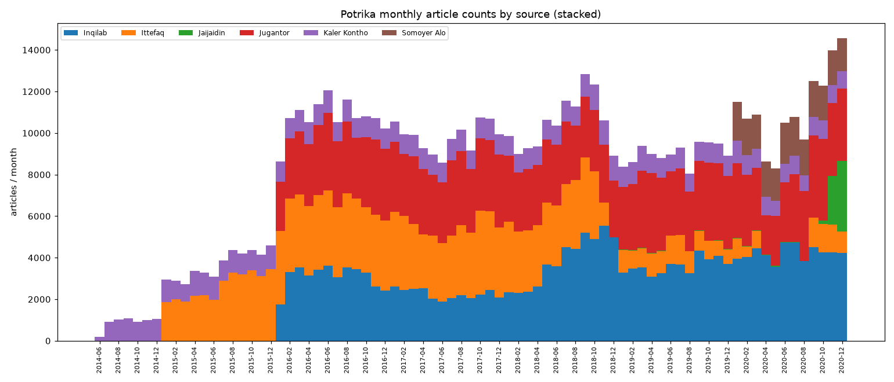

# TASK 1 — Potrika data audit report

- Generated: 2026-09-08T15:56:21
- Input: `data/raw/bn_potrika`
- Sample setting: 50,000 rows
- Seed: 42

Reproduce with:
```
python src/audit_potrika.py --input data/raw/bn_potrika --out reports/T1_report.md --sample 50000
```

Optional-dependency status:
- `regex` module: NOT available — ModuleNotFoundError("No module named 'regex'")
- `PyICU`: available (ICU 74.2)

## A. File inventory

Total CSV files found: **71**. Dated files (with `Date`+`Source`): **63**.

| file | size (MB) | format | rows | columns | dated? |
| --- | --- | --- | --- | --- | --- |
| BalancedDataset/Economy_40k.csv | 182.8 | csv | 40,848 | Unnamed: 0, article, class | no |
| BalancedDataset/Education_40k.csv | 174.1 | csv | 40,916 | Unnamed: 0, article, class | no |
| BalancedDataset/Entertainment_40k.csv | 121.3 | csv | 40,772 | Unnamed: 0, article, class | no |
| BalancedDataset/International_40k.csv | 144.8 | csv | 41,000 | Unnamed: 0, article, class | no |
| BalancedDataset/National_40k.csv | 181.5 | csv | 41,000 | Unnamed: 0, article, class | no |
| BalancedDataset/ScienceTechnology_40k.csv | 120.0 | csv | 43,395 | Unnamed: 0, article, class | no |
| BalancedDataset/Sports_40k.csv | 167.9 | csv | 41,000 | Unnamed: 0, article, class | no |
| BalancedDataset/politics_40k.csv | 153.6 | csv | 40,179 | Unnamed: 0, article, class | no |
| RawDataset/Economy/Inqilab__2016_2020_economy_text.csv | 50.2 | csv | 11,156 | Unnamed: 0, News, Category, Heading, Date, Source | yes |
| RawDataset/Economy/ittefaq_2015_2018_economy_text.csv | 15.3 | csv | 3,247 | Unnamed: 0, News, Category, Heading, Date, Source | yes |
| RawDataset/Economy/ittefaq_2019_2020_economy_text.csv | 2.6 | csv | 471 | Unnamed: 0, News, Category, Heading, Date, Source | yes |
| RawDataset/Economy/jaijaidin_2019_2020_economy_text.csv | 0.2 | csv | 48 | Unnamed: 0, News, Category, Heading, Date, Source | yes |
| RawDataset/Economy/jugantor_2016_2017_economy_text.csv | 30.9 | csv | 5,154 | Unnamed: 0, News, Category, Heading, Date, Source | yes |
| RawDataset/Economy/jugantor_2018_2020_economy_text.csv | 4.4 | csv | 930 | Unnamed: 0, News, Category, Heading, Date, Source | yes |
| RawDataset/Economy/kaler_kontho_2014_2020_economy_text.csv | 66.0 | csv | 15,306 | Unnamed: 0, News, Category, Heading, Date, Source | yes |
| RawDataset/Economy/somoyer_alo_2020_economy_text.csv | 12.1 | csv | 2,475 | Unnamed: 0, News, Category, Heading, Date, Source | yes |
| RawDataset/Education/Inqilab__2016_2020_education_text.csv | 3.9 | csv | 663 | Unnamed: 0, News, Category, Heading, Date, Source | yes |
| RawDataset/Education/ittefaq_2015_2018_education_text.csv | 11.1 | csv | 3,175 | Unnamed: 0, News, Category, Heading, Date, Source | yes |
| RawDataset/Education/ittefaq_2019_2020_education_text.csv | 0.3 | csv | 50 | Unnamed: 0, News, Category, Heading, Date, Source | yes |
| RawDataset/Education/jaijaidin_2019_2020_education_text.csv | 0.7 | csv | 171 | Unnamed: 0, News, Category, Heading, Date, Source | yes |
| RawDataset/Education/jugantor_2016_2017_education_text.csv | 6.5 | csv | 1,589 | Unnamed: 0, News, Category, Heading, Date, Source | yes |
| RawDataset/Education/jugantor_2018_2020_education_text.csv | 15.6 | csv | 3,249 | Unnamed: 0, News, Category, Heading, Date, Source | yes |
| RawDataset/Education/kaler_kontho_2014_2020_education_text.csv | 78.2 | csv | 12,704 | Unnamed: 0, News, Category, Heading, Date, Source | yes |
| RawDataset/Education/somoyer_alo_2020_education_text.csv | 2.1 | csv | 426 | Unnamed: 0, News, Category, Heading, Date, Source | yes |
| RawDataset/Entertainment/Inqilab__2016_2020_entertainment_text.csv | 46.4 | csv | 14,898 | Unnamed: 0, News, Category, Heading, Date, Source | yes |
| RawDataset/Entertainment/ittefaq_2015_2018_entertainment_text.csv | 27.4 | csv | 9,641 | Unnamed: 0, News, Category, Heading, Date, Source | yes |
| RawDataset/Entertainment/ittefaq_2019_2020_entertainment_text.csv | 6.0 | csv | 1,773 | Unnamed: 0, News, Category, Heading, Date, Source | yes |
| RawDataset/Entertainment/jaijaidin_2019_2020_entertainment_text.csv | 1.1 | csv | 333 | Unnamed: 0, News, Category, Heading, Date, Source | yes |
| RawDataset/Entertainment/jugantor_2016_2017_entertainment_text.csv | 13.8 | csv | 3,959 | Unnamed: 0, News, Category, Heading, Date, Source | yes |
| RawDataset/Entertainment/jugantor_2018_2020_entertainment_text.csv | 14.7 | csv | 4,175 | Unnamed: 0, News, Category, Heading, Date, Source | yes |
| RawDataset/Entertainment/somoyer_alo_2020_entertainment_text.csv | 8.2 | csv | 2,906 | Unnamed: 0, News, Category, Heading, Date, Source | yes |
| RawDataset/International/Inqilab__2016_2020_worldnews_text.csv | 192.0 | csv | 47,026 | Unnamed: 0, News, Category, Heading, Date, Source | yes |
| RawDataset/International/ittefaq_2015_2018_worldnews_text.csv | 70.3 | csv | 24,081 | Unnamed: 0, News, Category, Heading, Date, Source | yes |
| RawDataset/International/ittefaq_2019_2020_worldnews_text.csv | 28.7 | csv | 8,537 | Unnamed: 0, News, Category, Heading, Date, Source | yes |
| RawDataset/International/jaijaidin_2019_2020_worldnews_text.csv | 2.3 | csv | 545 | Unnamed: 0, News, Category, Heading, Date, Source | yes |
| RawDataset/International/jugantor_2016_2017_worldnews_text.csv | 32.3 | csv | 8,296 | Unnamed: 0, News, Category, Heading, Date, Source | yes |
| RawDataset/International/jugantor_2018_2020_worldnews_text.csv | 84.1 | csv | 22,056 | Unnamed: 0, News, Category, Heading, Date, Source | yes |
| RawDataset/International/kaler_kontho_2014_2020_worldnews_text.csv | 0.1 | csv | 8 | Unnamed: 0, News, Category, Heading, Date, Source | yes |
| RawDataset/International/somoyer_alo_2020_worldnews_text.csv | 10.5 | csv | 4,026 | Unnamed: 0, News, Category, Heading, Date, Source | yes |
| RawDataset/National/Inqilab__2016_2020_national_text.csv | 613.5 | csv | 103,602 | Unnamed: 0, News, Category, Heading, Date, Source | yes |
| RawDataset/National/ittefaq_2015_2018_national_text.csv | 255.7 | csv | 75,452 | Unnamed: 0, News, Category, Heading, Date, Source | yes |
| RawDataset/National/ittefaq_2019_2020_national_text.csv | 19.7 | csv | 4,936 | Unnamed: 0, News, Category, Heading, Date, Source | yes |
| RawDataset/National/jaijaidin_2019_2020_national_text.csv | 16.8 | csv | 4,424 | Unnamed: 0, News, Category, Heading, Date, Source | yes |
| RawDataset/National/jugantor_2016_2017_national_text.csv | 121.6 | csv | 28,217 | Unnamed: 0, News, Category, Heading, Date, Source | yes |
| RawDataset/National/jugantor_2018_2020_national_text.csv | 219.4 | csv | 54,105 | Unnamed: 0, News, Category, Heading, Date, Source | yes |
| RawDataset/National/kaler_kontho_2014_2020_national_text.csv | 82.0 | csv | 18,003 | Unnamed: 0, News, Category, Heading, Date, Source | yes |
| RawDataset/National/somoyer_alo_2020_national_text.csv | 23.5 | csv | 6,365 | Unnamed: 0, News, Category, Heading, Date, Source | yes |
| RawDataset/Politics/Inqilab__2016_2020_politics_text.csv | 2.0 | csv | 468 | Unnamed: 0, News, Category, Heading, Date, Source | yes |
| RawDataset/Politics/ittefaq_2015_2018_politics_text.csv | 35.7 | csv | 9,220 | Unnamed: 0, News, Category, Heading, Date, Source | yes |
| RawDataset/Politics/ittefaq_2019_2020_politics_text.csv | 0.1 | csv | 29 | Unnamed: 0, News, Category, Heading, Date, Source | yes |
| RawDataset/Politics/jaijaidin_2019_2020_politics_text.csv | 1.4 | csv | 301 | Unnamed: 0, News, Category, Heading, Date, Source | yes |
| RawDataset/Politics/jugantor_2016_2017_politics_text.csv | 23.0 | csv | 4,429 | Unnamed: 0, News, Category, Heading, Date, Source | yes |
| RawDataset/Politics/jugantor_2018_2020_politics_text.csv | 57.5 | csv | 11,304 | Unnamed: 0, News, Category, Heading, Date, Source | yes |
| RawDataset/Politics/kaler_kontho_2014_2020_politics_text.csv | 8.0 | csv | 1,628 | Unnamed: 0, News, Category, Heading, Date, Source | yes |
| RawDataset/Politics/somoyer_alo_2020_politics_text.csv | 2.8 | csv | 646 | Unnamed: 0, News, Category, Heading, Date, Source | yes |
| RawDataset/Science&Technology/Inqilab__2016_2020_scienceandtechnology_text.csv | 2.6 | csv | 544 | Unnamed: 0, News, Category, Heading, Date, Source | yes |
| RawDataset/Science&Technology/ittefaq_2015_2018_scienceandtechnology_text.csv | 18.7 | csv | 4,822 | Unnamed: 0, News, Category, Heading, Date, Source | yes |
| RawDataset/Science&Technology/ittefaq_2019_2020_scienceandtechnology_text.csv | 2.0 | csv | 357 | Unnamed: 0, News, Category, Heading, Date, Source | yes |
| RawDataset/Science&Technology/jaijaidin_2019_2020_scienceandtechnology_text.csv | 0.2 | csv | 53 | Unnamed: 0, News, Category, Heading, Date, Source | yes |
| RawDataset/Science&Technology/jugantor_2016_2017_scienceandtechnology_text.csv | 15.8 | csv | 4,172 | Unnamed: 0, News, Category, Heading, Date, Source | yes |
| RawDataset/Science&Technology/jugantor_2018_2020_scienceandtechnology_text.csv | 9.9 | csv | 1,821 | Unnamed: 0, News, Category, Heading, Date, Source | yes |
| RawDataset/Science&Technology/kaler_kontho_2014_2020_scienceandtechnology_text.csv | 25.8 | csv | 11,476 | Unnamed: 0, News, Category, Heading, Date, Source | yes |
| RawDataset/Science&Technology/somoyer_alo_2020_scienceandtechnology_text.csv | 1.7 | csv | 396 | Unnamed: 0, News, Category, Heading, Date, Source | yes |
| RawDataset/Sports/Inqilab__2016_2020_sports_text.csv | 123.3 | csv | 26,197 | Unnamed: 0, News, Category, Heading, Date, Source | yes |
| RawDataset/Sports/ittefaq_2015_2018_sports_text.csv | 51.9 | csv | 15,244 | Unnamed: 0, News, Category, Heading, Date, Source | yes |
| RawDataset/Sports/ittefaq_2019_2020_sports_text.csv | 12.9 | csv | 3,440 | Unnamed: 0, News, Category, Heading, Date, Source | yes |
| RawDataset/Sports/jaijaidin_2019_2020_sports_text.csv | 2.1 | csv | 499 | Unnamed: 0, News, Category, Heading, Date, Source | yes |
| RawDataset/Sports/jugantor_2016_2017_sports_text.csv | 73.3 | csv | 21,858 | Unnamed: 0, News, Category, Heading, Date, Source | yes |
| RawDataset/Sports/jugantor_2018_2020_sports_text.csv | 64.3 | csv | 16,692 | Unnamed: 0, News, Category, Heading, Date, Source | yes |
| RawDataset/Sports/kaler_kontho_2014_2020_sports_text.csv | 96.8 | csv | 17,618 | Unnamed: 0, News, Category, Heading, Date, Source | yes |
| RawDataset/Sports/somoyer_alo_2020_sports_text.csv | 16.5 | csv | 3,492 | Unnamed: 0, News, Category, Heading, Date, Source | yes |

**Schema groups** (files sharing an identical column set):

- Group 1: columns `['Unnamed: 0', 'article', 'class']` — 8 file(s)
- Group 2: columns `['Unnamed: 0', 'News', 'Category', 'Heading', 'Date', 'Source']` — 63 file(s)

**dtypes** (inferred by pandas on a 1000-row head, per schema group):

- `BalancedDataset/Economy_40k.csv`: `Unnamed: 0`=int64, `article`=str, `class`=str
- `RawDataset/Economy/Inqilab__2016_2020_economy_text.csv`: `Unnamed: 0`=int64, `News`=str, `Category`=str, `Heading`=str, `Date`=str, `Source`=str

> Schemas are **not** identical across all files: the corpus ships two families — a source/date-bearing `RawDataset` and a `BalancedDataset` that carries only article text + class. Sections C–G below operate on the dated `RawDataset` files, because publication date and newspaper source are what this project depends on. The `BalancedDataset` is inventoried here but excluded from the temporal/label audit (it has no date or source column).

## B. Column mapping

Actual columns in dated files: `['Unnamed: 0', 'News', 'Category', 'Heading', 'Date', 'Source']` (the leading unnamed column is a pandas row index that was written to disk).

| canonical | actual column |
| --- | --- |
| text | News |
| category | Category |
| headline | Heading |
| date | Date |
| source | Source |

All five canonical fields map cleanly.

## C. Date parsing

**20 raw date strings, verbatim, sampled across sources:**

| source | raw Date (repr) |
| --- | --- |
| Inqilab | '2019/01/25' |
| Inqilab | '2020/02/23' |
| Inqilab | '2018/06/11' |
| Ittefaq | '2016/10/27' |
| Ittefaq | '2015/10/29' |
| Ittefaq | '2016/11/07' |
| Jaijaidin | '2020/12/06' |
| Jaijaidin | '2020/12/09' |
| Jaijaidin | '2020/12/16' |
| Jugantor | '2017/03/27' |
| Jugantor | '2016/11/19' |
| Jugantor | '2019/05/20' |
| Kaler Kontho | '2015/06/15' |
| Kaler Kontho | '2020/08/08' |
| Kaler Kontho | '2020/07/07' |
| Somoyer Alo | '2020/03/17' |
| Somoyer Alo | '2020/04/15' |
| Somoyer Alo | '2020/02/21' |
| Inqilab | '2018/10/29' |
| Ittefaq | '2017/07/05' |

**Format match counts** (each row attributed to the first format that parsed it):

| format | rows matched | % of all rows |
| --- | --- | --- |
| `%Y/%m/%d` | 664,883 | 100.00% |
| **unparseable** | 1 | 0.00% |

Overall parse rate: **100.00%** (664,883 / 664,884).

**Per newspaper source:**

| source | n rows | n parsed | parse rate | min date | max date |
| --- | --- | --- | --- | --- | --- |
| Inqilab | 204,554 | 204,554 | 100.00% | 2016-01-01 | 2020-12-30 |
| Ittefaq | 164,475 | 164,475 | 100.00% | 2015-01-01 | 2020-12-30 |
| Jaijaidin | 6,374 | 6,373 | 99.98% | 2019-01-01 | 2020-12-22 |
| Jugantor | 192,006 | 192,006 | 100.00% | 2016-01-01 | 2020-12-30 |
| Kaler Kontho | 76,743 | 76,743 | 100.00% | 2014-06-25 | 2020-12-30 |
| Somoyer Alo | 20,732 | 20,732 | 100.00% | 2020-01-01 | 2020-12-30 |

**Up to 15 unparseable raw date strings, verbatim, with source:**

| source | raw Date (repr) |
| --- | --- |
| Jaijaidin | '2019/02/30' |

**Implausible parsed dates:**

| check | count |
| --- | --- |
| before 2010-01-01 | 0 |
| after today (2026-09-08) | 0 |

No source collapses >50% of its rows onto a single date (no obvious sentinel).

## D. Temporal coverage

**Article counts per (year × source):**

| year | Inqilab | Ittefaq | Jaijaidin | Jugantor | Kaler Kontho | Somoyer Alo | total |
| --- | --- | --- | --- | --- | --- | --- | --- |
| 2014 | 0 | 0 | 0 | 0 | 6,154 | 0 | 6,154 |
| 2015 | 0 | 31,437 | 0 | 0 | 12,402 | 0 | 43,839 |
| 2016 | 37,079 | 41,488 | 0 | 38,379 | 12,064 | 0 | 129,010 |
| 2017 | 27,041 | 39,478 | 0 | 39,295 | 11,824 | 0 | 117,638 |
| 2018 | 46,455 | 32,479 | 0 | 34,888 | 12,168 | 0 | 125,990 |
| 2019 | 43,280 | 12,147 | 270 | 40,704 | 11,581 | 0 | 107,982 |
| 2020 | 50,699 | 7,446 | 6,103 | 38,740 | 10,550 | 20,732 | 134,270 |
| **total** | 204,554 | 164,475 | 6,373 | 192,006 | 76,743 | 20,732 | 664,883 |

A full (year, month) × source breakdown is large; it is summarised in the figure below and mined for zero cells next.

**Coverage gaps** — (source, month) cells with zero articles inside that source's own min–max range:

| source | range | # missing months | missing months |
| --- | --- | --- | --- |
| Ittefaq | 2015-01..2020-12 | 6 | 2018-12, 2020-04, 2020-05, 2020-06, 2020-07, 2020-08 |
| Jaijaidin | 2019-01..2020-12 | 2 | 2020-08, 2020-09 |

Combined stream span: **2014-06 → 2020-12**. Missing months in the combined stream: 0. Longest consecutive gap: **0 month(s)**.

Figure: `reports/figs/T1_coverage.png` — stacked monthly article counts by source.



## E. Label fields

**Article count per newspaper source** (the S6 publisher-prediction target — imbalance matters):

| source | count | share |
| --- | --- | --- |
| Inqilab | 204,554 | 30.77% |
| Jugantor | 192,006 | 28.88% |
| Ittefaq | 164,475 | 24.74% |
| Kaler Kontho | 76,743 | 11.54% |
| Somoyer Alo | 20,732 | 3.12% |
| Jaijaidin | 6,374 | 0.96% |

Imbalance ratio (largest ÷ smallest source): **32.1×**.

**Article count per category:**

| category | count | share |
| --- | --- | --- |
| National | 295,104 | 44.38% |
| International | 114,575 | 17.23% |
| Sports | 105,040 | 15.80% |
| Economy | 38,787 | 5.83% |
| Entertainment | 37,685 | 5.67% |
| Politics | 28,025 | 4.22% |
| Education | 22,027 | 3.31% |
| Science_Technology | 18,819 | 2.83% |
| science-and-tech | 4,822 | 0.73% |

> **Inconsistent category labels detected** — the same topic appears under more than one spelling and must be canonicalised before the secondary topic-prediction task:
> - `Science_Technology` (18,819), `science-and-tech` (4,822)

**Cross-tab source × category:**

| source | Economy | Education | Entertainment | International | National | Politics | Science_Technology | Sports | science-and-tech |
| --- | --- | --- | --- | --- | --- | --- | --- | --- | --- |
| Inqilab | 11,156 | 663 | 14,898 | 47,026 | 103,602 | 468 | 544 | 26,197 | 0 |
| Ittefaq | 3,718 | 3,225 | 11,414 | 32,618 | 80,388 | 9,249 | 357 | 18,684 | 4,822 |
| Jaijaidin | 48 | 171 | 333 | 545 | 4,424 | 301 | 53 | 499 | 0 |
| Jugantor | 6,084 | 4,838 | 8,134 | 30,352 | 82,322 | 15,733 | 5,993 | 38,550 | 0 |
| Kaler Kontho | 15,306 | 12,704 | 0 | 8 | 18,003 | 1,628 | 11,476 | 17,618 | 0 |
| Somoyer Alo | 2,475 | 426 | 2,906 | 4,026 | 6,365 | 646 | 396 | 3,492 | 0 |

## F. Word counting

PyICU imported: **yes** (ICU 74.2).
`regex` module imported: **no — falling back to stdlib `re`** (error: ModuleNotFoundError("No module named 'regex'")).

Computed on a random **2000**-document subsample.

| method | mean | median | p5 | p95 |
| --- | --- | --- | --- | --- |
| whitespace split() | 241.7 | 183.0 | 68.0 | 607.1 |
| re \w+ (UNICODE) | 616.5 | 476.5 | 178.9 | 1566.0 |
| ICU BreakIterator (bn) | 244.4 | 186.0 | 68.0 | 616.0 |

**Pearson correlation between methods:**

| pair | pearson r |
| --- | --- |
| whitespace split() vs re \w+ (UNICODE) | 0.9911 |
| whitespace split() vs ICU BreakIterator (bn) | 0.9998 |
| re \w+ (UNICODE) vs ICU BreakIterator (bn) | 0.9920 |

Mean ratio **ICU ÷ whitespace** = **1.012** (median 1.009).

**3 documents where the methods disagree most:**

| # | whitespace split() | re \w+ (UNICODE) | ICU BreakIterator (bn) | text preview |
| --- | --- | --- | --- | --- |
| 1 | 2617 | 5590 | 2604 | পূর্ণাঙ্গ মডেল টেস্ট (পূর্ণমান ১০০) বহু নির্বাচনী প্রশ্নের মান ৩০, সৃজনশীলে ৭০ ব… |
| 2 | 1604 | 4284 | 1629 | হাসান সোহেল : চিকিৎসা সেবা নাগরিকের মৌলিক অধিকার। সরকারি হাসপাতালগুলো স্বল্পমূল্… |
| 3 | 1593 | 4073 | 1601 | ডেঙ্গু জ্বরের প্রকোপ ক্রমে ভয়াবহ আকার ধারণ করছে। ঘরে ঘরে ডেঙ্গু রোগী। সরকারি-বেস… |

## G. Text quality

Computed on the 49,717-document text sample (document length measured with `str.split()` whitespace words).

| percentile | words |
| --- | --- |
| p1 | 39 |
| p5 | 68 |
| p25 | 126 |
| p50 | 187 |
| p75 | 296 |
| p95 | 602 |
| p99 | 998 |

| metric | value |
| --- | --- |
| documents in sample | 49,717 |
| under 50 words (dropped later) | 987 (1.99%) |
| empty / whitespace-only text | 169 (0.34%) |
| exact duplicates (by normalised hash) | 179 (0.36%) |
| contains Latin-script chars (code-mix proxy) | 1,096 (2.20%) |

## STATUS

```
GATE 1 — date parse rate >=95% in ALL six sources:        PASS   (min per-source parse rate 99.98% over 6 sources)
GATE 2 — combined coverage spans 2014-2020, no gap >2 months:  PASS   (span 2014-06..2020-12, longest combined gap 0 month(s))
GATE 3 — all six sources present with >=5,000 articles:   PASS   (6 sources, smallest has 6,374 articles)
GATE 4 — a usable word-count method exists:  PASS   (PyICU BreakIterator available)

VERDICT: PROCEED WITH CAVEATS
Blockers:
  - none
Surprises worth a human decision:
  - Corpus ships two dataset families; only RawDataset carries Date+Source. BalancedDataset (article/class only) is unusable for the drift stream.
  - Category label collision: Science_Technology (18,819), science-and-tech (4,822)
  - 169 empty/whitespace-only article bodies in the sample (0.34%).
```

